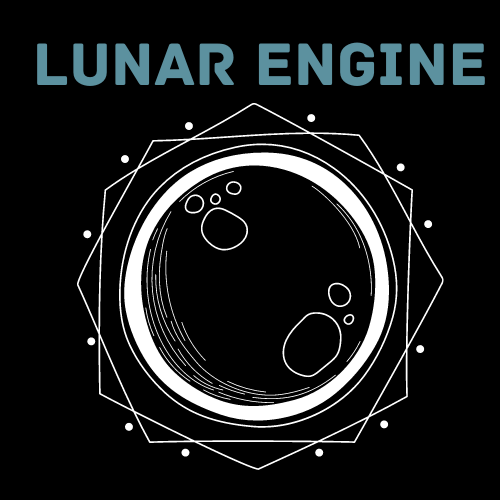

<p align="center">
  <a href="https://lunarengine.xyz">
    
  </a>
</p>

[//]: # (# Lunar Engine)

### Create Environment Variables
```bash
BINANCE_TEST_API_KEY=something
BINANCE_TEST_API_SECRET=something
BINANCE_LIVE_API_KEY=something
BINANCE_LIVE_API_SECRET=something
# true if using testnet Binance or Alpaca, false if live (real money!)
TESTNET=true
```

### Steps to deploy to virtual machine
```bash
# GitHub, manage terminal processes, and Cargo build dependencies
sudo apt install -y git screen build-essential libsasl2-dev pkg-config libfontconfig libfontconfig1-dev

# Install Rust
curl https://sh.rustup.rs -sSf | sh

# Set GitHub remote
git remote add origin https://github.com/LunarEngine/lunar_engine.git
git reset --hard origin/main
git pull origin main

# Create a screen to run the algorithm
screen -R plpl

# Start the algorithm on Binance
cargo run -r -p binance_plpl

# Start the algorithm on Alpaca
cargo run -r -p alpaca_plpl

# Exit screen with Ctrl+A then D

# Print logs on the main screen
cat plpl.log
# Follow logs on the main screen
tail -f plpl.log

# To reenter the screen
screen -r plpl

# To kill the screen
screen -X -S plpl quit
```

### Create Release Tag
```bash
git tag -a tag-name -m 'tag-message'

git push origin tag-name

# Go to GitHub and create a release
```